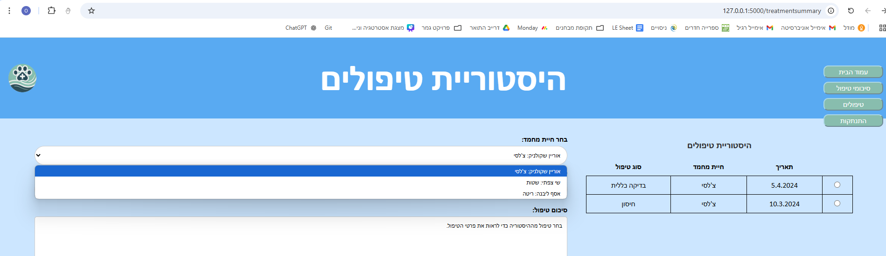

# Vetrinat - A Veterinary Website

## Part 3

### Project Overview

VetRinat is a website for managing Dr.Rinat's veterinary clinic, which is designed for both pet owners and
veterinarians. On the site, pet owners can manage personal profiles and track their pets' medical history, as well as
view the upcoming appointment date set by the clinic. At the same time, the veterinarian receives tools for updating
treatment records, allowing her to manage treatment documentation efficiently and transparently.

### Core Functionalities

1. **User Authentication**
2. **User Accounts** – A 2-step registration process focusing on the owner and then the pet.
3. **Detailed Pet Profiles** – Information on breed, gender, age, weight, and more, including the ability to view
   upcoming appointments for the pet and to edit the pet’s details.
4. **Medical Summaries** – For pet owners, the Medical Summary page displays detailed treatment summaries for every
   treatment the pet has undergone in the past. For the veterinarian, the interface allows switching between clients to
   review the treatment summaries, as well as adding or modifying these records.
5. **Navigation Bar** – Provides intuitive access to the main sections of the website, including a sub-menu that leads
   to the profile of each pet.

---

--- 

### Guided Experience:

The system offers a comprehensive user experience with a guided tour that introduces you to all functionalities using
three different points of view:

1. shay's point of view
2. Dr.Rinat's point of view
3. your point of view

In the upper right corner, you may choose whether to register or log in.     
After submitting each form you will be redirected to the homepage.

--- 

### **shay's point of view:**

Please select "Login" and enter the following user to experience:

**Username**: Shay@example.com    
**User Password**: Secret123

You can observe a change in the navbar—it now displays a "Personal Area" button that opens a sub-menu listing the pets
you have registered on the site. Additionally, you have the option to add another pet for treatment via this sub-menu.

  
  

Please press the **"Personal Area"** button and then choose the button for **"שטות"** to see the matching profile.  
The pet’s profile is displayed with all the details entered during registration.
Additionally, information about an upcoming meeting (if available) is displayed; if there are no meetings, an
appropriate message will be displayed (the database query will be updated if there is an upcoming meeting).

To see this function implemented, we will ask you at this point to run the "[create_a_future_appointment.py](
)" file and then refresh your internet browser.

On this page you can also choose between two buttons:

- Edit the pet's details. The edit button which will navigate you to the data editing page.
- Navigate to the medical history viewing page.

For the next step please press the **medical history** button.
On this page you may choose between the different appointments to view DR. Rinat's summary.

**Note:** Although you may see the up-coming meetings on this page as well, you can't choose to view an up-coming
meeting summary.

Please log out by clicking the button in the navbar.

---

### **you're point of view**

Please select "Registration" and go through a 2-step registration process.    
**step 1**: Register a new user. After submitting the first form you will be redirected to **step 2**; Register a new
pet.

You can add another pet by clicking on the "Personal Area" and then selecting the "Add" button in the navbar. This will
direct you to the pet registration page. After completing the form, you'll be redirected to the home page, where the new
pet will appear in the navbar.

Alternatively, follow the steps outlined in Shay's perspective until you reach the pet’s profile page. Once there, click
the “Edit” button to update the pet’s information. The “Edit” button directs you to the pet registration page, and after
completing the form, you'll be returned to the profile page.   
(Note: During the initial registration, users are redirected to the home page.)

--- 

### **Dr.Rinat's point of view**

Please select "Login" and enter the following user to experience:

**Username**: rinat@vetrinat.com  
**User Password**: Password456

Another change can be seen in the navbar due to the role defined for the doctor, it is now showing a "treatment
summaries" button that guides you to the treatment summary page.

On the treatment summaries page you can select from a scrolling list of the registered clients and pets for whom you
would like to view
past summaries or write a new summary.    
You are welcome to experiment on "אוריין- צ'לסי " or  "שי- שטות".

If you've registered your own pet, you should be able to see both your pet and you there.       
However, due to the lack of appointments, you won't be able to submit a treatment summary.

Please log out by clicking the button in the navbar

---
**We hope you enjoyed exploring our site and found our guided tour helpful.**

--- 

---

### Technologies Used

- HTML
- Vanilla JavaScript
- CSS
- Flask (Jinja2)

--- 

### Contributors

- Orianne Shcolnik
- Shai Tsfaty

